# Firewall Rules Testing

El objetivo de estas pruebas es verificar el correcto funcionamiento de las reglas definidas en el firewall y como se muestran en el dashboard de Wazuh.

---
## Reglas de la interfaz WAN

#### WAN -> DMZ TCP 3000 = PASS: Tracking ID 1769487539 

Desde el navegador se accede a la URL de el servidor web en el puerto 3000.

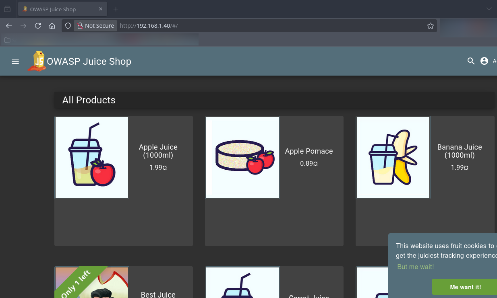 

Se evidencia que el firewall registró la acción.

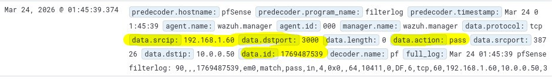 

#### BLOCK Todo desde WAN:  Tracking ID 1769488056

Desde un navegador fuera de la red de Virtualbox intento acceder a la IP de el firewall usando el puerto 443.

 

Se evidencia que el firewall bloqueo el trafico desde WAN al puerto 80.

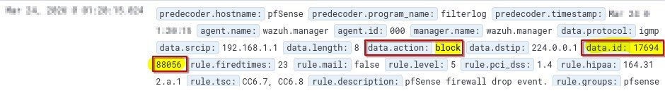 

---

## Reglas de la interfaz DMZ

#### DMZ -> LAN = BLOCK: Tracking ID 1769407069

Hago ping desde el server en DMZ al cliente en LAN

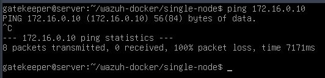 

Se refleja el log del paquete de ICMP en Wazuh

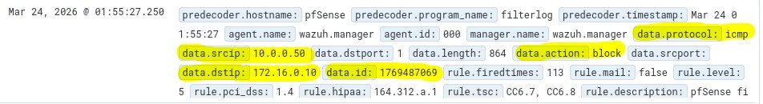 

#### DMZ -> WAN = PASS: Tracking ID 1769487015

Hago ping desde DMZ a google.com

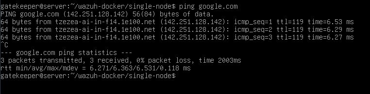 

En Wazuh se refleja el log al DNS de Google

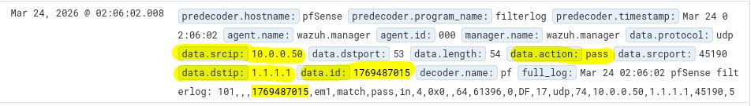 

---

## Reglas de la interfaz LAN

#### Debian Admin -> Wazuh Dashboard: Tracking ID 1771559538

Accedo al dashboard de Wazuh desde el debian en LAN

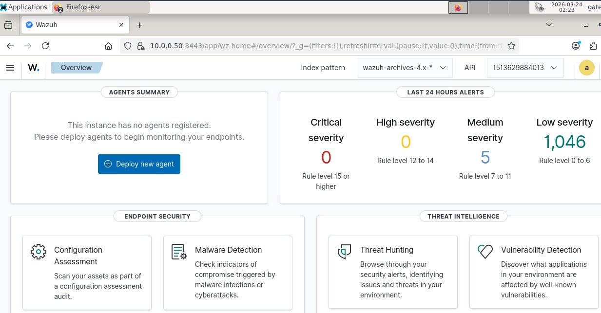 

Log en el dashboard de Wazuh

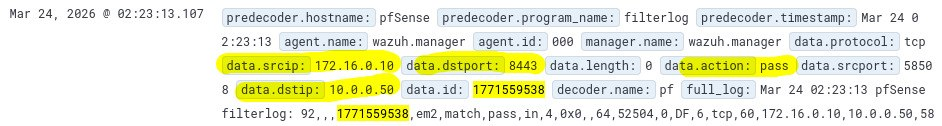 

#### 172.16.0.10 -> 10.0.0.50 TCP 22 = PASS: Tracking ID 1769488682

Accedo por SSH al server desde el debian cliente en LAN

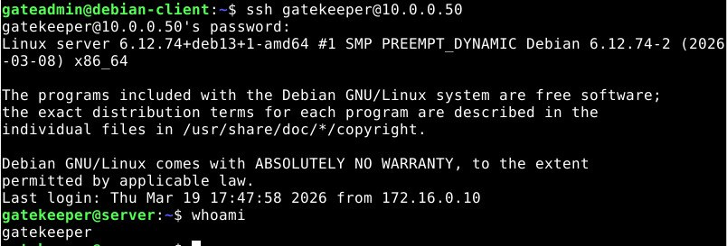 

Log en el dashboard de Wazuh

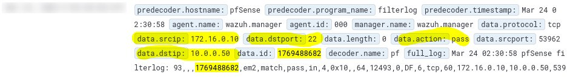 

#### LAN -> DMZ = BLOCK: Tracking ID  1769488878

Intento acceder a la aplicación web en DMZ

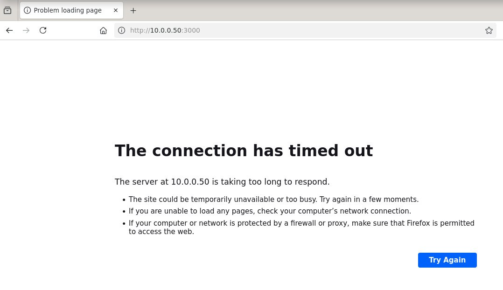

Log en el dashboard de Wazuh

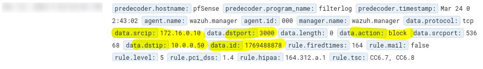

---

## Conclusión

Las reglas evaluadas cumplen su función y ademas se están logeando exitosamente en Wazuh, lo cual permite hacer seguimiento de el trafico que es filtrado por el firewall.